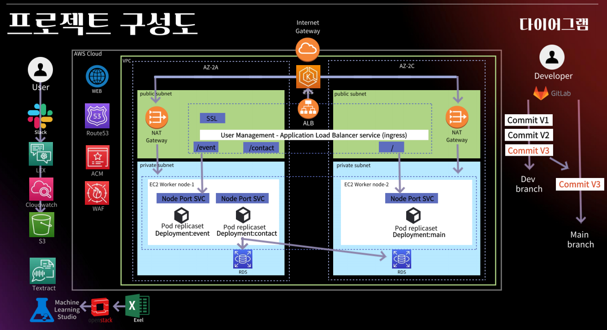

# JoinUs Megazone Tech Conference Project

Megazone International Tech Conference의 주제로 PCO(국제 회의 전문 기획사)의 입장에서 Project를 기획하고 웹 애플리케이션과 자동화 배포 파이프라인(CI/CD)을 구축한 프로젝트 입니다.

## Architecture

## Contributor

- 김수빈 : 기획, AI서비스, 네트워크 구성
- 서혜진 : 웹서비스, 모니터링, 보안
- 유서준 : EKS, Gitlab CI/CD 자동화

### 기능

- Azure ML

  - Azure ML을 이용한 컨퍼런스 참여자들의 참가여부 예측서비스 구축

- AWS Lex

  - AWS Lex를 이용한 컨퍼런스 사용자가 직접 참여하는 챗봇서비스 구축

- AWS Textract

  - AWS Textract을 이용한 어드민 관리 서비스 제공, 사진의 글자를 자동으로 추출해주는 textract 서비스로 전반적인 관리 작업에 시간 감소

- AWS Cloudformation

  - 인프라 구축의 기본인 네트워크 서비스 구성을 cloudformation을 통해 구성하여 자동화 일조

- AWS RDS

  - AWS RDS 생성하여 DB 구축, contact페이지를 통해 문의사항 DB에 업로드

- Grafana/prometheus

  - eks와 cloudwatch를 연동해 실시간 모니터링 시스템 구축

- AWS EKS

  - terraform을 이용하여 aws 서비스 자동화
  - alb/ingress

- WEB

  - nginx를 이용하여 프로트엔드 구축
  - flask를 이용하여 백엔드 구축
  - 각 페이지의 이미지 container화를 통해 msa로 구성
  - teachable machine을 이용해 ai 서비스 구현

- GitLab CI/CD
  - Cf, Terraform등 IaC를 활용하여 자동화 Pipeline 구축
  - Container Image Build,Push -> Cloudformation(네트워크 인프라) -> Terraform(eks) -> alb, monitoring, service deploy -> Domain
